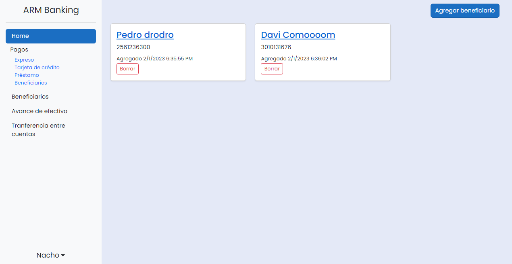

<div align="center">
  


    


</div>

# NetBanking App

Baking application that allows customers to access and make any type of bank payments and transactions. It allows administrators to perform any management on the user's account.

- Application of the Onion Architecture and Solid principles
- Mail services with the MimeKit package
- User and role management with Identity
- Different functionalities are realised depending on the type of user logging into the app.

<hr></hr>
<h2>Technologies</h2>
<ul>
  <li>C# Asp.Net Core</li>
  <li>Entity Framework</li>
  <li>SQL Server</li>
  <li>Auto Mapper</li>
  <li>Bootstrap 5</li>
</ul>
<hr></hr>

## What do you need to run this project ?
* [Visual Studio](https://visualstudio.microsoft.com)

<h2>How to run</h2>

1. Clone this repo.
2. Open **NetBanking.sln** in Visual Studio.
3. Set **NetBanking** as startup project to run web app.
4. The database is remote.
But if you want to add to local database you need to open the file called "appsettings.json" and put the name of your server or computer where applicable, example:
    ```cmd
    Server=Your_Server;
    ```
    When you are in the nuget package console type the following command:
    ````cmd
    Update-database
5. **Start the project**.

  
 ## Project images
- Login 
 
[](./Imgs/Login.PNG)
<br>
- Home Client
 
[](./Imgs/HomeClient.PNG)

[](./Imgs/HomeClient1.PNG)

[](./Imgs/Beneficiary.PNG)

<br>

- Payments
  
[](./Imgs/Payment.PNG)

<br>

- Home Admin

[](https://postimg.cc/tY9mcfG4)
 
[](https://postimg.cc/gLHtJy8p)
 
- User Manager
 [](./Imgs/ManageUsers.PNG)
[](./Imgs/ManageUser.PNG)
 

<br><br>
## Developer
- Yeferson Rubio -> [Github](https://github.com/YefersonR) 
- Jefferson Abreu -> [Github](https://github.com/AbreuHD) 
- Eliam Medina -> [Github](https://github.com/Elian1202) 


